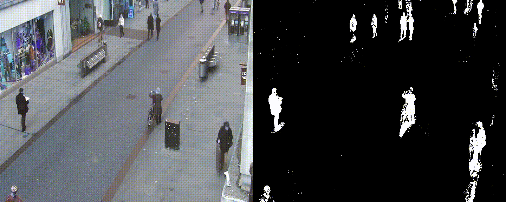

# Vibe - background detection and subtraction


## Table of Contents
- [Introduction](#introduction)
- [Requirement](#requirement)
- [Usage](#usage)
    - [Run](#run)
- [Maintainers](#maintainers)

## Introduction
This is my Python implementation for the following paper, which efficiency is up to 300fps.
> ViBe: a powerful random technique to estimate the background in video sequences

## Requirements
- CUDA
- CuPy
- Python
- OpenCV

## Usage

### Run
Use opencv-python: 

```python main.py```

or opencv-cuda: 

```python mainCuda.py```

## Maintainers
[@Zixin Liu](liuzixin1126@gmail.com)
